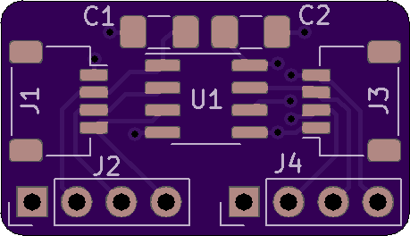

I2C Isolator Board.  

Uses TI iso1540 IC or equivalent.

Includes Sparkfun qwiic connectors (and headers).

Designed in kicad.

Available at [oshpark](https://oshpark.com/shared_projects/gqwzSxCl)

